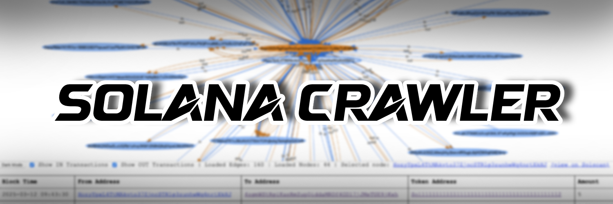

# Solana Crawler

<br><br>

<br><br>

This project provides a tool to visualize Solana account transactions. It fetches transaction data for a given Solana address and displays it as a network graph which can be recursevly explored.

## Prerequisites
* **Python**: >=3.13
* **Poetry**: >=2.0.1

## Installation

```bash
git clone https://github.com/paoloechoes/solana-crawler.git && cd solana-crawler && chmod +x ./install && ./install.sh
```

## Installation (Manual)

1.  Clone the repository.
2.  Navigate to the project directory.
3.  Run the installation script:

    ```bash
    ./install.sh
    ```

    This script will:

    * Install the project dependencies using `poetry install`. 
    * Make the crawler script executable. 
    * Create a symlink to the crawler script in `~/.local/bin/`.
    * Update your shell configuration (sourcing `~/.bashrc` or `~/.zshrc`).

## How to Use

1.  Run the crawler script:

    ```bash
    solana-crawler <Solana_address>
    ```

    This will start a local server and open a web browser with the transaction graph for the given Solana address.

## Example

```bash
solana-crawler HPCdHgyku9pmWQKPCM9NMpX9rmWmS2mTpxuKTKKAQc4x
```


This will open the network graph showing by default the latest **10 IN** and **10 OUT** transactions for the give address.

---

You can change the displayed number of transactions to whatever you like(up to reasonable amount) by using the `num` parameter in the URL


---

Thickness of the edges reflect the relative value of the transaction, meaning thicker lines represent bigger value transaction relative to the other ones.


## Author
- [Paolo Anzani]("https://x.com/paoloechoes")
- anzanipaolo.enquires@gmail.com